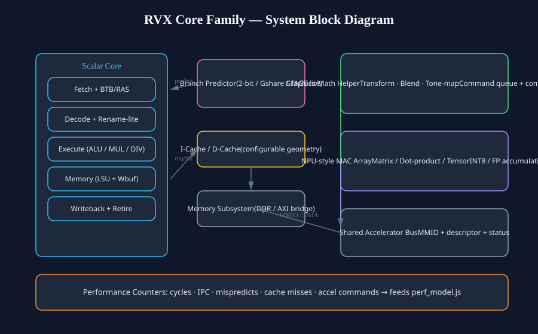
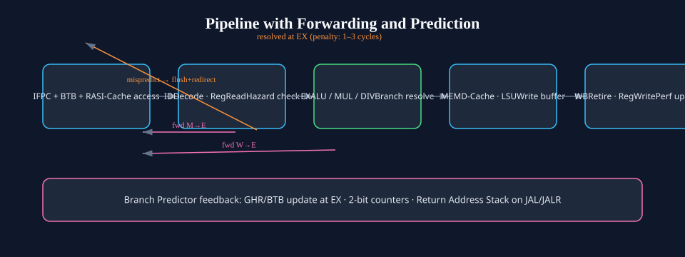
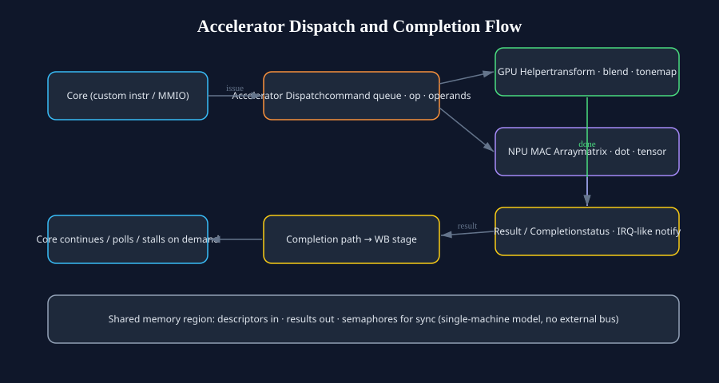
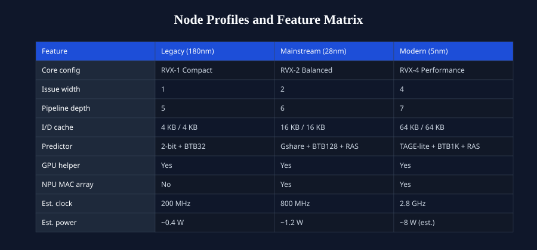

# RISCV_Pipeline_Core — RVX Core Family

A **parameterized RISC-V core family** with on-chip graphics/math and NPU-style
accelerators, configurable across legacy through modern process nodes, with a
performance estimation model and generated documentation diagrams.



## What this is

This started as a classic single-issue 5-stage RISC-V teaching pipeline
(`IF → ID → EX → MEM → WB`) and was rewritten into a **configurable core family**:

- **Scalar core** — parameterized in-order pipeline with explicit stage registers,
  full bypass/forwarding (MEM→EX, WB→EX, load-use stalls), separate multiply/divide
  path, and a **mode-parameterized branch predictor**: bimodal (legacy), gshare with
  folded global history (mainstream), tage-lite with 2× history + larger tables
  (modern), all with a Return Address Stack (`Branch_Predictor.v`).
- **Dual-issue dispatch** — real RTL (`Issue_Unit.v`): in-order 2-slot issue with
  RAW/WAW dependency gating for independent ALU pairs — the 2-issue profile is
  actual hardware, not a model knob.
- **Memory hierarchy** — configurable I-cache and D-cache (`Cache_Core.v`) with
  hit/miss tracking, refill interface, and write handling.
- **Graphics/math helper (iGPU-style)** — functional 2-cycle pipelined unit
  (`Graphics_Unit.v`): fixed-point pixel blend, tone-map, 4-lane 8-bit dot product,
  and small matrix multiply — synthesizable on every node, no FP dependency.
- **NPU-style MAC array** — 4-lane **signed INT8 MAC** with a 32-bit running
  accumulator (`NPU_Unit.v`): tensor-MAC accumulation, dot product, read-status,
  and reset commands — verified round trip in simulation.
- **Node profiles** — the same RTL family configured for legacy (180 nm-class),
  mainstream (28 nm-class), and modern (5 nm-class) nodes with different issue
  width, cache geometry, predictor capacity, and accelerator inclusion.
- **Performance estimation** — `tools/perf_model.js` produces clearly-labeled
  estimated benchmarks per node profile and workload; `tools/generate_diagrams.js`
  generates all documentation diagrams so they stay in sync with the architecture.

> **Honest positioning:** this is not silicon that beats a Core Ultra 7 in real
> games. It is a credible, tunable open-source core *family* whose design DNA
> (prediction, caches, accelerators, node scaling) is the same DNA those chips
> use — plus a transparent performance model instead of hand-waved claims.

## Architecture



### Source layout

| File | Role |
|---|---|
| `src/Pipeline_Top.v` | Top-level integration of all stages + accelerators |
| `src/Pipeline_Fetch.v` | PC generation, prediction, I-fetch |
| `src/Pipeline_Decode.v` | Decode, register read, hazard checks |
| `src/Pipeline_Execute.v` | ALU / branch resolve / forwarding muxes |
| `src/Pipeline_Memory.v` | D-cache access, load/store path |
| `src/Pipeline_Writeback.v` | Result mux, register writeback |
| `src/Branch_Predictor.v` | Bimodal / gshare / tage-lite predictor + BTB + RAS |
| `src/Cache_Core.v` | Configurable cache (I/D instantiation) |
| `src/Multiplier_Divider.v` | Separate MUL/DIV execution path |
| `src/Issue_Unit.v` | Dual-issue dispatch with dependency gating |
| `src/Graphics_Unit.v` | GPU helper: blend / tone-map / dot / matmul |
| `src/NPU_Unit.v` | 4-lane INT8 MAC array with accumulator |
| `src/Accelerator_Dispatch.v` | Command queue + routing + result path |
| `src/Core_Params.v` | Node-profile configuration knobs |
| `src/Riscv_Defs.v` | Shared opcodes, opcodes, perf-event constants |

## Accelerators



The core dispatches accelerator work through a command queue (`Accelerator_Dispatch.v`)
into two real functional units:

- **Graphics_Unit** (2-cycle pipelined): pixel blend, tone-map, 4-lane dot
  product, small matmul — all fixed-point, no FP dependency.
- **NPU_Unit** (1-cycle): 4-lane signed INT8 MAC with a 32-bit accumulator;
  consecutive TENSOR_MAC commands accumulate, READ_STATUS reads the total.

Results return through a single arbitrated completion channel. **Verified in
simulation**: MAC accumulate 14 → 114, read-back 114, dot product 20, with per-unit
perf counters. This models the "CPU + iGPU + NPU" structure of modern SoCs inside
one machine.

## Node profiles



| Profile | Node class | Config | Est. clock |
|---|---|---|---|
| RVX-1 Compact | Legacy (180 nm-class) | 1-issue, 4KB caches, 2-bit predictor, GPU helper | 200 MHz |
| RVX-2 Balanced | Mainstream (28 nm-class) | 2-issue, 16KB caches, gshare + RAS, GPU + NPU | 800 MHz |
| RVX-4 Performance | Modern (5 nm-class) | 4-issue, 64KB caches, TAGE-lite + RAS, GPU + NPU | 2.8 GHz |

## Estimated benchmarks

See **[docs/BENCHMARKS.md](docs/BENCHMARKS.md)** for the full estimated table and
[docs/benchmarks.json](docs/benchmarks.json) for raw data. Highlights (estimated):

| Profile | Integer proxy perf | AI inference perf | Perf/W (est.) |
|---|---|---|---|
| RVX-1 (legacy) | 0.17 | 0.5 | ~0.5 |
| RVX-2 (mainstream) | 1.08 | 4.5 | ~1.0 |
| RVX-4 (modern) | 6.72 | 28.2 | ~3.2 |

**These are model outputs, not measurements.** The model combines base IPC per
configuration with workload mix (branch/memory/vector/accelerator rates), node
clock assumptions, and power scaling. Regenerate with:

```sh
node tools/perf_model.js
```

## Build and simulate

```sh
# Compile + run testbench (Icarus Verilog)
iverilog -g2012 -I src -o build/core.vvp src/Pipeline_Top.v src/pipeline_tb.v
vvp build/core.vvp

# Regenerate diagrams and benchmarks
node tools/generate_diagrams.js
node tools/perf_model.js
```

## Documentation

- [docs/ARCHITECTURE_DIRECTION.md](docs/ARCHITECTURE_DIRECTION.md) — target machine spec
- [docs/BENCHMARKS.md](docs/BENCHMARKS.md) — estimated performance tables
- [docs/FAB_READINESS.md](docs/FAB_READINESS.md) — what's done vs. what remains before tapeout

## License

Copyright 2023-2026 MERL-DSU. Licensed under the Apache License, Version 2.0 —
see [LICENSE](LICENSE).
